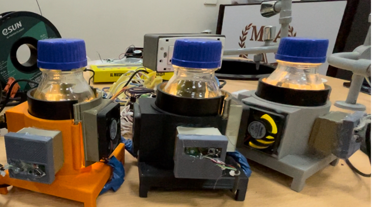

#  
 RDI-PBR. 

 RDI PhotoBioreactor. 

# 
 RDI Prototyping Lab, Faculty of Biotechnology, MSA university. 

 Microalgae photoBioreactor, DIY and AI based, Smart image recognition for cellular stress factors. 

 Authors: Ziyad Adbelal, Doha Ibrahim, Adam Maged, Mostafa Hesham, and  Ahmed Gomaa. 

 

 
 

Welcome to the RDI PhotoBioreactor project! This Do-It-Yourself (DIY) microalgae bioreactor is designed to facilitate the evolution of microalgae cells under harsh conditions. The reactor incorporates advanced features such as image recognition based on AI models, real-time monitoring of cellular stress, chemostatic control through cooling and stirring, as well as color sensing capabilities using a camera module. This cost-effective solution is specifically tailored for microbial adaptive evolution studies.

## Features

### 1. **AI Image Recognition:**
   - The RDI PhotoBioreactor is equipped with an advanced AI model for image recognition.
   - The AI model distinguishes between stressed and healthy microalgae cells.
   - Real-time analysis provides insights into the stress levels that the cells are undergoing.

### 2. **Chemostatic Control:**
   - The reactor ensures precise control of environmental conditions through chemostatic regulation.
   - Cooling and stirring mechanisms maintain optimal conditions for the microalgae cells.

### 3. **Color Sensing:**
   - A built-in color sensing system enables the monitoring of changes in cell pigmentation.
   - This feature allows for a more comprehensive understanding of the cellular response to stress.

### 4. **Camera Module:**
   - The integrated camera module captures images for the AI model and provides a visual record of experiments.
   - High-quality images aid in the detailed analysis of cellular morphology and health.

### 5. **Microbial Adaptive Evolution:**
   - The RDI PhotoBioreactor is specifically designed to support studies in microbial adaptive evolution.
   - Users can explore and understand how microalgae cells adapt and evolve under various stress conditions.

## Getting Started

Follow these steps to set up your RDI PhotoBioreactor:

1. **Hardware Assembly:**
   - Refer to the hardware documentation for assembling the bioreactor components.
   - Ensure all connections are secure and follow safety guidelines.

2. **Software Installation:**
   - Clone this repository to your local machine.
   - Install the required dependencies using the provided instructions.

3. **Configuration:**
   - Configure the AI model parameters and set up the chemostatic control settings.
   - Adjust color sensing parameters based on your experiment requirements.

4. **Run the Experiment:**
   - Execute the provided scripts to start the experiment.
   - Monitor the real-time data and visualize the results.

## Contributing

We welcome contributions from the community to enhance the RDI PhotoBioreactor project. Feel free to submit bug reports, feature requests, or contribute to the codebase. Please follow the guidelines outlined in the [CONTRIBUTING.md](CONTRIBUTING.md) file.

## License

This project is licensed under the- see the [LICENSE](LICENSE) file for details.

## Acknowledgments

We would like to express our gratitude to the open-source community for their invaluable contributions and support.

Happy experimenting with the RDI PhotoBioreactor!

# CONTRIBUTORS 
Ziyad Abdelaal, 
Doha Ibrahim,
Adam Maged, and
Mostafa Hesham 
Supervised by: Ahmed Gomaa
